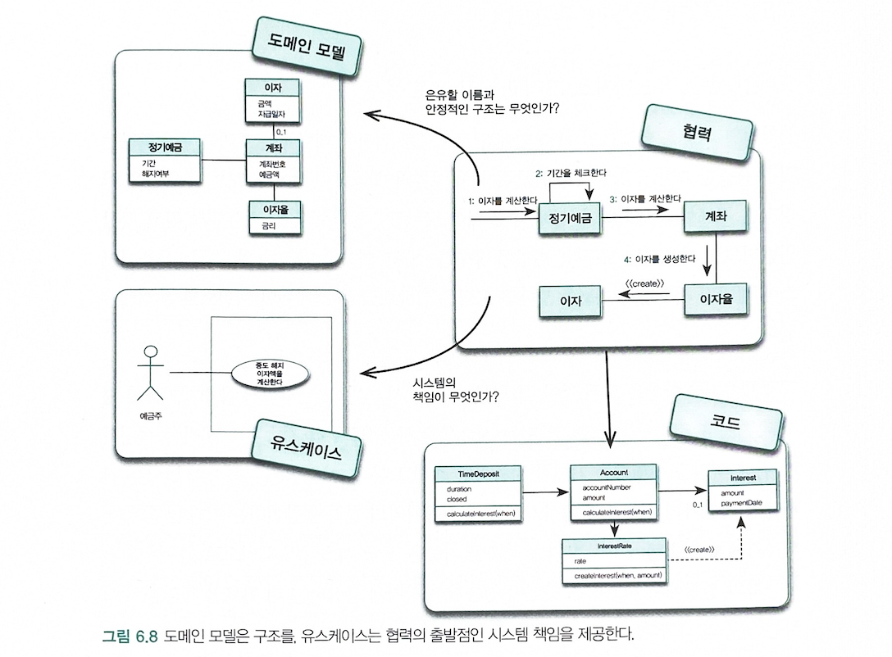

# 기능 설계 대 구조 설계
- 기능(function): 제품이 사용자를 위해 무엇을 할 수 있는지에 초점을 맞춘다.
- 구조(structure): 제품의 형태가 어떠해야 하는지에 초점을 맞춘다.

> 전통적인 기능 분해(Functional decomposition)는 자주 변경되는 기능을 중심으로 설계한 후 구조가 기능에 따르게 한다. 해당 방법은 변경에 취약하다.

> 객체지향 접근방법은 자주 변경되지 않는 안정적인 객체 구조를 바탕으로 시스템 기능을 객체 간의 책임으로 분배한다.
> 객체를 기반으로 책임과 역할을 식별하고 메세지를 기반으로 개체들의 협력 관계를 구축하여 안정적인 객체 구조를 만들면 변경을 수용 할 수 있다.

- 객체 지도는 안정적이며 재사용이 가능하면서도 범용적이다.

# 두가지 재료: 기능과 구조
- 구조는 사용자나 이해관계자들이 도메인(domain)에 관해 생각하는 개념과 개념들 간의 관계로 표현
- 기능은 사용자의 목표를 만족시키기 위해 책임을 수행하는 시스템의 행위로 표현
- *유스케이스 모델링* : 기능을 수집하고 표현하기 위한 기법
- *도메인 모델링* : 구조를 수집하고 표현하기 위한 기법
- *유스케이스와 도메인 모델* : 두 가지 모델링 활동의 결과물

# 안정적인 재료: 구조
### 도메인 모델
- *도메인* : 사용자가 프로그램을 사용하는 대상 분야
- 모델 : 대상을 단순화해서 표현한것
- *도메인 모델* : 
	- 사용자가 프로그램을 사용하는 대상 영역에 관한 지식을 선택적으로 단순화하고 의식적으로 구조화한 형태
	- 소프트웨어가 목적하는 영역 내의 개념과 개념 간의 관계
	- 다양한 규칙이나 제약 등을 주의 깊게 추상화 한것
	- 소프트웨어 개발과 관련된 이해관계자들이 도메인에 대해 생각하는 관점

> 은행 도메인 - 고객과 계좌 사이의 돈의 흐름
> 자동차 도메인 - 중고 자동차 판매상은 구매되는 자동차와 판매되는 자동차의 교환
> 게임 도메인 - 플레이어들은 캐릭터와 몬스터, 그리고 몬스터가 떨구는 아이템의 관계

### 도메인의 모습을 담을 수 있는 객체지향
- 애플리케이션이 도메인 모델을 기반으로 설계 되어야 한다.
- 객체지향은 도메인 모델의 세 가지 측면을 가장 범용적으로 만족시킬 수 있는 유일한 모델링 패러다임
- *연결완전성(표현적 차이)* : 객체지향을 이용하면 도메인에 대한 사용자 모델, 디자인 모델, 시스템 이미지 모두가 유사한 모습을 유지하도록 만드는 것이 가능하다.

### 표현적 차이
- 소프트웨어 객체와 현실 객체 사이의 의미적 거리를 가리켜 표현적 차이(의미적 차이) 라고 한다.
- 도메인 모델을 기반으로 설계하고 구현하는 것은 사용자가 도메인을 바라보는 관점을 그대로 코드에 반영할 수 있게 되고 표현적 차이를 줄일 수 있다.

### 불안정한 기능을 담는 안정적인 도메인 모델
> 도메인 모델의 핵심은 **사용자가 도메인을 바라보는 관점을 반영해 소프트웨어를 설계하고 구현** 

- 안정적인 구조를 제공하는 도메인 모델을 기반으로 소프트웨어의 구조를 설계하면 변경에 유연하게 대응 할 수있는 탄력적인 소프트웨어를 만들 수 있다.

# 불안정한 재료: 기능
### 유스케이스
- 시스템이 사용자에게 제공해야 하는 기능의 목록을 정리한 것
- 사용자의 목표를 달성하기 위해 사용자와 시스템 간에 이뤄지는 상호작용의 흐름을 텍스트로 정리한 것

### 유스케이스의 특성
1. 유스케이스는 사용자와 시스템 간의 상호작용을 보여주는 '텍스트'다.
2. 유스케이스는 하나의 시나리오가 아니라 여러 시나리오들의 집합이다.
3. 유스케이스는 단순한 피처(feature) 목록과 다르다.
4. 유스케이스는 사용자 인터페이스와 관련된 세부 정보를 포함하지 말아야 한다.
5. 유스케이스는 내부 설계와 관련된 정보를 포함하지 않는다.

### 유스케이스는 설계 기법도, 객체지향 기법도 아니다
> 유스케이스에는 단지 사용자가 시스템을 통해 무엇을 얻을 수 있고 어떻게 상호작용할 수 있는지 관한 정보만 기술된다.
> 유스케이스는 객체지향과도 상관이 없다.
> 유스케이스를 기반으로 객체의 구조나 책임에 대해 알 수 없다. 어떤 정보도 제공하지 않는다.

# 재료 합치기: 기능과 구조의 통합
### 도메인 모델, 유스케이스, 그리고 책임-주도 설계
- `도메인 모델` : 안정적인 구조를 개념화 하기 위해
- `유스케이스` : 불안정한 기능을 서술하기 위해 사용되는 도구

> 변경에 유연한 소프트웨어를 만들기 위해 
> 유스케이스에 정리된 시스템의 기능을 도메인 모델을 기반으로 한 객체들의 책임으로 분배해야 한다.

> 협력의 출발을 장식하는 첫 번째 메세지는 시스템의 기능을 시스템의 책임으로 바꾼 후 얻어지고 책임-주도 설계는 이 지점부터 적용된다.

- 유스케이스 : 사용자에게 제공할 기능을 시스템의 책임으로 보게 함으로써 객체 간의 안정적인 구조에 책임을 분배할 수 있는 출발점을 제공
- 도메인 모델 : 기능을 수용하기 위해 은유할 수 있는 안정적인 구조를 제공
- 책임-주도 설계 : 유스케이스로부터 첫 번째 메세지와 사용자가 달성하려는 목표를, 도메인 모델로부터 기능을 수용할 수 있는 안정적인 구조를 제공받아 실제로 동작하는 객체들의 협력 공동체를 창조한다.

### 기능 변경을 흡수하는 안정적인 구조
도메인 모델이 안정적인 이유:
- 도메인 모델을 구성하는 개념은 비지니스가 없어지거나 완전히 개편되지 않는 한 안정적으로 유지된다.
- 도메인 모델을 구성하는 개념 간의 관계는 비즈니스 규칙을 기반으로 하기 때문에 비지니스 정책이 크게 변경되지 않는 한 안정적으로 유지된다.

객체지향의 장점:
- 도메인을 모델링하기 위한 기법과 도메인을 프로그래밍하기 위해 사용하는 기법이 동일하다. -> 연결완전성
- 코드의 변경으로부터 도메인 모델의 변경 사항을 유추할 수 있다 -> 가역성

