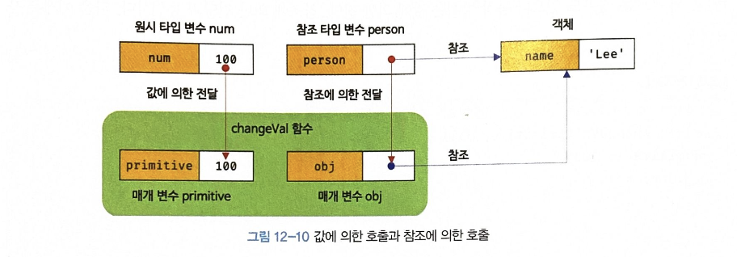

## 🐹 12-4 함수 정의

### 12-4-3 함수 생성 시점과 호이스팅
```javascript
// 함수 참조
console.dir(add); // f add(x, y)
console.dir(sub); // undefined

// 함수 호출
console.log(add(2, 5)); // 7
console.log(sub(2, 5)); // TypeError: sub is not a function

// 함수 선언문
function add(x, y){
	return x + y;
}

// 함수 표현식
var sub = function (x, y){
	return x - y;
};

```

> 쉽게 호이스팅이 일어나는걸 표현 하면

```javascript
// 함수 호이스팅
function add(x, y){
	return x + y;
}
var sub

// 함수 참조
console.dir(add); // f add(x, y)
console.dir(sub); // undefined

// 함수 호출
console.log(add(2, 5)); // 7
console.log(sub(2, 5)); // TypeError: sub is not a function
```

> 이렇게 된다고 옮겨 놓고 보면 이해가 잘된다.

> 변수 할당문의 값은 할당문이 실행되는 시점, 즉 런타임에 평가되므로 함수 표현식의 함수 리터럴도 할당문이 실행되는 시점에 평가되어 함수 객체가 된다.
> 함수 표현식으로 함수를 정의하면 **함수 호이스팅이 발생하는것이 아니라 변수 호이스팅** 이 발생한다.


## 🐱 12-6 참조에 의한 전달과 외부 상태의 변경
```javascript
// 매개변수 primitive는 원시 값을 전달받고, 매개변수 obj는 객체를 전달받는다.
function changeVal(primitive, obj) {
  primitive += 100;
  obj.name = 'Kim';
}

// 외부 상태
var num = 100;
var person = { name: 'Lee' };

console.log(num); // 100
console.log(person); // {name: "Lee"}

// 원시 값은 값 자체가 복사되어 전달되고 객체는 참조 값이 복사되어 전달된다.
changeVal(num, person);

// 원시 값은 원본이 훼손되지 않는다.
console.log(num); // 100

// 객체는 원본이 훼손된다.
console.log(person); // {name: "Kim"}
```



> 외부상태, 즉 함수 외부에서 함수 몸체 내부로 전달한 참조값에 의해 원본 객체가 변경되는 부수 효과가 발생한다. 
> 이러한 문제의 해결 방법 중 하나는 객체를 *불변 객체(immutable object)* 로 만들어서 사용하는것이다.
> 외부 상태를 변경하지 않고 외부 상태에 의존하지도 않는 함수를 *순수 함수* 라 한다.

## 🐭 12-7 다양한 함수의 형태
### 12-7-1 즉시 실행 함수 IIFE (Immediately Invoked Function Expression)
```javascript
// 익명 즉시 실행 함수
(function () {
  var a = 3;
  var b = 5;
  return a * b;
}());
```

- [n] comment
> 옛날에 Jquery를 사용할때 많이 봤던 형식인것 같다.

### 12-7-2 재귀 함수(recursive function)
> 함수가 자기 자신을 호출하는 것을 재귀 호출(recursive call)이라 한다. 재귀 함수는 자기 자신을 호출 하는 행위, 즉 재귀 호출을 수행하는 함수를 말한다.

```javascript
// 팩토리얼(계승)은 1부터 자신까지의 모든 양의 정수의 곱이다.
// n! = 1 * 2 * ... * (n-1) * n
function factorial(n) {
  // 탈출 조건: n이 1 이하일 때 재귀 호출을 멈춘다.
  if (n <= 1) return 1;
  // 재귀 호출
  return n * factorial(n - 1);
}

console.log(factorial(0)); // 0! = 1
console.log(factorial(1)); // 1! = 1
console.log(factorial(2)); // 2! = 2 * 1 = 2
console.log(factorial(3)); // 3! = 3 * 2 * 1 = 6
console.log(factorial(4)); // 4! = 4 * 3 * 2 * 1 = 24
console.log(factorial(5)); // 5! = 5 * 4 * 3 * 2 * 1 = 120
```

### 12-7-3 중첩 함수
> 함수 내부에 정의된 함수를 중첩 함수 또는 내부 함수 라 한다.

```javascript
function outer() {
  var x = 1;

  // 중첩 함수
  function inner() {
    var y = 2;
    // 외부 함수의 변수를 참조할 수 있다.
    console.log(x + y); // 3
  }

  inner();
}

outer();
```

### 12-7-4 콜백 함수
#Javascript/callback-function 

> 함수의 매개변수를 통해 다른 함수의 내부로 전달되는 함수를 *콜백 함수 (callback function)* 라고 하며, 매개 변수를 통해 함수의 외부에서 콜백 함수를 전달받은 함수를 *고차 함수(Higher-Order-function, HOF)* 라고 한다.

> 고차 함수는 매개변수를 통해 전달받은 콜백 함수의 호출 시점을 결정해서 호출한다.
> 콜백 함수는 고차 함수에 의해 호출되며 이때 고차 함수는 필요에 따라 콜백 함수에 인수를 전달할 수 있다.

```javascript
// 익명 함수 리터럴을 콜백 함수로 고차 함수에 전달한다.
// 익명 함수 리터럴은 repeat 함수를 호출할 때마다 평가되어 함수 객체를 생성한다.
repeat(5, function (i) {
  if (i % 2) console.log(i);
}); // 1 3
```

```javascript
// logOdds 함수는 단 한 번만 생성된다.
var logOdds = function (i) {
  if (i % 2) console.log(i);
};

// 고차 함수에 함수 참조를 전달한다.
repeat(5, logOdds); // 1 3
```

```javascript
// 콜백 함수를 사용하는 고차 함수 map
var res = [1, 2, 3].map(function (item) {
  return item * 2;
});

console.log(res); // [2, 4, 6]

// 콜백 함수를 사용하는 고차 함수 filter
res = [1, 2, 3].filter(function (item) {
  return item % 2;
});

console.log(res); // [1, 3]

// 콜백 함수를 사용하는 고차 함수 reduce
res = [1, 2, 3].reduce(function (acc, cur) {
  return acc + cur;
}, 0);

console.log(res); // 6
```

### 12-7-5 순수 함수와 비순수 함수
> 어떤 외부 상태에 의존하지도 않고 변경하지도 않는 함수를 *순수 함수(pure function)* 
> 외부 상태에 의존하거나 외부 상태를 변경하는 함수를 *비순수 함수(impure function)* 

```javascript
var count = 0; // 현재 카운트를 나타내는 상태

// 순수 함수 increase는 동일한 인수가 전달되면 언제나 동일한 값을 반환한다.
function increase(n) {
  return ++n;
}

// 순수 함수가 반환한 결과값을 변수에 재할당해서 상태를 변경
count = increase(count);
console.log(count); // 1

count = increase(count);
console.log(count); // 2
```

> 순수 함수 예제

```javascript
var count = 0; // 현재 카운트를 나타내는 상태: increase 함수에 의해 변화한다.

// 비순수 함수
function increase() {
  return ++count; // 외부 상태에 의존하며 외부 상태를 변경한다.
}

// 비순수 함수는 외부 상태(count)를 변경하므로 상태 변화를 추적하기 어려워진다.
increase();
console.log(count); // 1

increase();
console.log(count); // 2
```

> 비 순수 함수 예제


