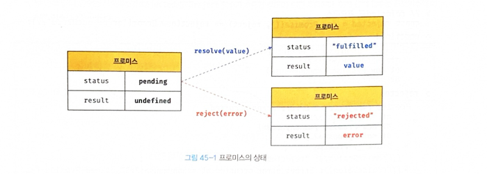
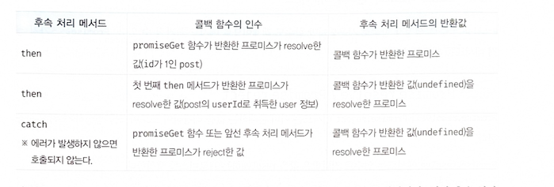

## 🦊 45-2 프로미스의 생성
> Promise 생성자 함수를 new 연산자와 함께 호출하면 프로미스(Promise 객체)를 생성한다.
> ES6에서 도입된 Promise는 호스트 객체가 아닌 ECMAScript 사양에 정의된 표준 빌트인 객체다.

```javascript
// 프로미스 생성
const promise = new Promise((resolve, reject) => {
  // Promise 함수의 콜백 함수 내부에서 비동기 처리를 수행한다.
  if (/* 비동기 처리 성공 */) {
    resolve('result');
  } else { /* 비동기 처리 실패 */
    reject('failure reason');
  }
});
```

```javascript
// GET 요청을 위한 비동기 함수
const promiseGet = url => {
  return new Promise((resolve, reject) => {
    const xhr = new XMLHttpRequest();
    xhr.open('GET', url);
    xhr.send();

    xhr.onload = () => {
      if (xhr.status === 200) {
        // 성공적으로 응답을 전달받으면 resolve 함수를 호출한다.
        resolve(JSON.parse(xhr.response));
      } else {
        // 에러 처리를 위해 reject 함수를 호출한다.
        reject(new Error(xhr.status));
      }
    };
  });
};

// promiseGet 함수는 프로미스를 반환한다.
promiseGet('https://jsonplaceholder.typicode.com/posts/1');
```

>비동기 함수인 promiseGet은 함수 내부에서 프로미스를 생성하고 반환한다.
>비동기 처리는 Promise 생성자 함수가 인수로 전달받은 콜백 함수 내부에서 수행한다.
>비동기 처리가 성공하면 비동기 처리 결과를 **resolve**  함수에 인수로 전달하면서 호출.
>비동기 처리가 실패하면 에러를 **reject** 함수에 인수로 전달하 면서 호출.


- 프로미스는 다음과 같이 현재 비동기 처리가 어떻게 진행되고 있는지를 나타내는 상태(state) 정보를 갖는다.


> 생성된 직후의 프로미스는 기본적으로 pending 상태다.
> 비동기 처리가 수행되면 비동기 처리 결과에 따라 다음과 같이 프로미스의 상태가 변경된다.

- 비동기 처리 성공 : resolve 함수를 호출해 프로미스를 fulfilled 상태로 변경한다.
- 비동기 처리 실패 : reject 함수를 호출해 프로미스를 rejected 상태로 변경한다.


> 프로미스의 상태는 resolve 또는 reject 함수를 호출하는 것으로 결정된다.



- fullfilled 또는 rejected 상태를 settled 상태라고한다.
- settled 상태는 fulfilled 또는 rejected 상태와 상관없이 pending이 아닌 상태로 비동기 처리가 수행된 상태를 말한다.
- 프로미스는 pending 상태에서 fullfilled 또는 rejected 상태, 즉 settled 상태로 변화할 수 있다.
- 하지만 일단 settled 상태가 되면 더는 다른 상태로 변화할 수 없다. 즉 다시 pending 상태가 될 수 없다.

> **프로미스는 비동기 처리 상태와 처리 결과를 관리하는 객체다.** 


## 🐶 45-3 프로미스와 후속 처리 메서드
> 프로미스의 비동기 처리 상태가 변화하면 후속 처리 메서드에 인수로 전달한 콜백 함수가 선택적으로 호출된다.


### 45-3-1 Promise.prototype.then
> then 메서드는 두 개의 콜백 함수를 인수로 전달받는다.

- 첫 번째 콜백 함수는 프로미스가 fullfilled 상태(resolve 함수가 호출된 상태)가 되면 호출된다. 이때 콜백 함수는 프로미스의 비동기 처리 결과를 인수로 전달받는다.
- 두 번째 콜백 함수는 프로미스가 rejected 상태(reject 함수가 호출된 상태)가 되면 호출된다. 이때 콜백 함수는 프로미스의 에러를 인수로 전달받는다.

> 첫 번째 콜백 함수는 비동기 처리가 성공했을 때 호출되는 성공 처리 콜백 함수
> 두 번째 콜백 함수는 비동기 처리가 실패했을 때 호출되는 실패 처리 콜백 함수

```javascript
// fulfilled
new Promise(resolve => resolve('fulfilled'))
  .then(v => console.log(v), e => console.error(e)); // fulfilled

// rejected
new Promise((_, reject) => reject(new Error('rejected')))
  .then(v => console.log(v), e => console.error(e)); // Error: rejected
```

> then 메서드는 언제나 프로미스를 반환한다.
> 만약 then 메서드의 콜백 함수가 프로미스를 반환하면 그 프로미스를 그대로 반환하고,
> 콜백 함수가 프로미스가 아닌 값을 반환하면 그 값을 암묵적으로 resolve 또는 reject하여 프로미스를 생성해 반환한다.


### 45-3-2 Promise.prototype.catch
> catch 메서드는 한 개의 콜백 함수를 인수로 전달받는다.
> catch 메서드의 콜백 함수는 프로미스가 rejected 상태인 경우만 호출된다.

```javascript
// rejected
new Promise((_, reject) => reject(new Error('rejected')))
  .catch(e => console.log(e)); // Error: rejected
```

> then 메서드와 마찬가지로 언제나 프로미스를 반환한다.


### 45-3-3 Promise.prototype.finally
> finally 메서드는 한 개의 콜백 함수를 인수로 전달받는다.
> finally 메서드의 콜백 함수는 프로미스의 성공(fulfilled) 또는 실패(rejected)와 상관없이 무조건 한 번 호출된다.
> finally 메서드는 프로미스의 상태와 상관없이 공통적으로 수행해야 할 처리 내용이 있을 때 유용하다.
> finalLy 메서드도 then/catch 메서드와 마 찬가지로 언제나 프로미스를 반환한다.

```javascript
new Promise(() => {})
  .finally(() => console.log('finally')); // finally
```


## 🧚 45-5 프로미스 체이닝
> then, catch, finally 후속 처리 메서드는 언제나 프로미스를 반환하므로 연속적으로 호출할 수 있다.
> 이를 *프로미스 체이닝(promise chaning)*  이라 한다.

```javascript
const url = 'https://jsonplaceholder.typicode.com';

// id가 1인 post의 userId를 취득
promiseGet(`${url}/posts/1`)
  // 취득한 post의 userId로 user 정보를 취득
  .then(({ userId }) => promiseGet(`${url}/users/${userId}`))
  .then(userInfo => console.log(userInfo))
  .catch(err => console.error(err));
```



> then, catch, finally 후속 처리 메서드는 콜백 함수가 반환한 프로미스를 반환한다.
> 만약 후속 처리 메서드의 콜백 함수가 프로미스가 아닌 값을 반환하더라도 그 값을 암묵적으로 resolve 또는 reject하여 프로미스를 생성해 반환한다.

- [n] comment
> 즉, .then((result, reject) => return 1) 이렇게 하더라도 실제로는 .then((result, reject) => return Promise.resolve(1)) 이렇게 반환 한다는 뜻


## 45-6 프로미스의 정적 메서드
> Promise는 주로 생성자 함수로 사용되지만 함수도 객체이므로 메서드를 가질 수 있다.


### 45-6-1 Promise.resolve / Promise.reject

```javascript
// 배열을 resolve하는 프로미스를 생성
const resolvedPromise = Promise.resolve([1, 2, 3]);
resolvedPromise.then(console.log); // [1, 2, 3]
```

```javascript
const resolvedPromise = new Promise(resolve => resolve([1, 2, 3]));
resolvedPromise.then(console.log); // [1, 2, 3]
```

> 두개가 동일하게 동작한다.


### 45-6-2 Promise.all

> Promise.all 메서드는 여러 개의 비동기 처리를 모두 병렬 처리할 때 사용한다.

```javascript
const requestData1 = () => new Promise(resolve => setTimeout(() => resolve(1), 3000));
const requestData2 = () => new Promise(resolve => setTimeout(() => resolve(2), 2000));
const requestData3 = () => new Promise(resolve => setTimeout(() => resolve(3), 1000));

// 세 개의 비동기 처리를 순차적으로 처리
const res = [];
requestData1()
  .then(data => {
    res.push(data);
    return requestData2();
  })
  .then(data => {
    res.push(data);
    return requestData3();
  })
  .then(data => {
    res.push(data);
    console.log(res); // [1, 2, 3] ⇒ 약 6초 소요
  })
  .catch(console.error);

```

> 첫 번째 비동기 처리에 3초, 두 번째 비동기 처리에 2초, 세 번째 비동기 처리 에 1초가 소요되어 총 6초 이상이 소요된다.
> 세 개의 비동기 처리는 서로 의존하지 않고 개별적으로 수행된다. 
> 즉, 앞선 비동기 처 리 결과를 다음 비동기 처리가 사용하지 않는다.
> 따라서 위 예제의 경우 세 개의 비동기 처리를 순차적으로 처리할 필요가 없다.

```javascript
const requestData1 = () => new Promise(resolve => setTimeout(() => resolve(1), 3000));
const requestData2 = () => new Promise(resolve => setTimeout(() => resolve(2), 2000));
const requestData3 = () => new Promise(resolve => setTimeout(() => resolve(3), 1000));

Promise.all([requestData1(), requestData2(), requestData3()])
  .then(console.log) // [ 1, 2, 3 ] ⇒ 약 3초 소요
  .catch(console.error);
```

> Promise all 메서드는 프로미스를 요소로 갖는 배열 등의 이터러블을 인수로 전달받는다.
> 그리고 전달받은 모든 프로미스가 모두 fullfilled 상태가 되면 모든 처리 결과를 배열에 저장해 새로운 프로미스를 반환한다.
> 위 예제의 경우 Promise.all 메서드는 3개의 프로미스를 요소로 갖는 배열을 전달받았다.

- 첫 번째 프로미스는 3초 후에 1을 resolve한다.
- 두 번째 프로미스는 2초 후에 2를 resolve한다.
- 세 번째 프로미스는 1초 후에 3을 resolve한다.

> Promise.all 메서드는 인수로 전달받은 배열의 모든 프로미스가 모두 fullfilled 상태가 되면 종료한다.
> **따라서 Promise.all 메서드가 종료하는 데 걸리는 시간은 가장 늦게 fulfilled 상태가 되는 프로미스의 처리 시간보다 조금 더 길다.** (즉 6초가 아니라 가장 늦은 시간 3초보다 조금 더 다)
> 위 예제의 경우 모든 처리에 걸리는 시간은 가장 늦게 fullfilled 상태가 되는 첫 번 째 프로미스의 처리 시간인 3초보다 조금 더 소요된다.

> 모든 프로미스가 fullfilled 상태가 되면 resolve된 처리 결과(위 예제의 경우 1, 2, 3)를 모두 배열에 저장해 새로운 프로미스를 반환한다.
> 이때 첫 번째 프로미스가 가장 나중에 fullfilled 상태가 되어도 Promise.all 메서드는 첫 번째 프로미스가 resolve한 처리 결과부터 차례대로 배열에 저장해 그 배열을 resolve하는 새로운 프로미스를 반환한다. 즉, **처리 순서가 보장된다.** 
> **Promise.all 메서드는 인수로 전달받은 배열의 프로미스가 하나라도 rejected 상태가 되면 나머지 프로미스 가 fullfilled 상태가 되는 것을 기다리지 않고 즉시 종료한다.** 


```javascript
Promise.all([
  new Promise((_, reject) => setTimeout(() => reject(new Error('Error 1')), 3000)),
  new Promise((_, reject) => setTimeout(() => reject(new Error('Error 2')), 2000)),
  new Promise((_, reject) => setTimeout(() => reject(new Error('Error 3')), 1000))
])
  .then(console.log)
  .catch(console.log); // Error: Error 3
```

> 세 번째 프로미스가 가장 먼저 rejected 상태가 되므로 세 번째 프로미스가 reject한 에러가 catch 메서드로 전달된다.


```javascript
Promise.all([
  1, // => Promise.resolve(1)
  2, // => Promise.resolve(2)
  3  // => Promise.resolve(3)
])
  .then(console.log) // [1, 2, 3]
  .catch(console.log);
```

>Promise.all 메서드는 인수로 전달받은 이터러블의 요소가 프로미스가 아닌 경우 Promise.resolve 메서드를 통해 프로미스로 래핑한다.


### 45-6-3 Promise.race
> 프로미스를 요소로 갖는 배열 등의 이터러블을 인수로 전달받는다.
> Promise.race 메서드는 Promise.all 메서드처럼 모든 프로미스가 fulfilled 상태가 되는 것을 기다리는 것이
> 아니라 가장 먼저 fulfilled 상태가 된 프로미스의 처리 결과를 resolve하는 새로운 프로미스를 반환한다.

```javascript
Promise.race([
  new Promise(resolve => setTimeout(() => resolve(1), 3000)), // 1
  new Promise(resolve => setTimeout(() => resolve(2), 2000)), // 2
  new Promise(resolve => setTimeout(() => resolve(3), 1000)) // 3
])
  .then(console.log) // 3
  .catch(console.log);
```

> 에러 Promise.all과 처리 동일


### 45-6-4 Promise.allSettled
>Promise.allSettled 메서드는 프로미스를 요소로 갖는 배열 등의 이터러블을 인수로 전달받는다.
>그리고 전달받은 프로미스가 모두 settled 상태(비동기 처리가 수행된 상태, 즉 fulfilled 또는 rejected 상태)
>가 되면 처리 결과를 배열로 반환한다.

```javascript
Promise.allSettled([
  new Promise(resolve => setTimeout(() => resolve(1), 2000)),
  new Promise((_, reject) => setTimeout(() => reject(new Error('Error!')), 1000))
]).then(console.log);
/*
[
  {status: "fulfilled", value: 1},
  {status: "rejected", reason: Error: Error! at <anonymous>:3:54}
]
*/
```

> Promise.allSettled 메서드가 반환한 배열에는 fulfilled 또는 rejected 상태와는 상관없이 Promise.allSettled 메서드가 인수로 전달받은 모든 프로미스들의 처리 결과가 모두 담겨 있다.

- 프로미스가 fulfilled 상태인 경우 비동기 처리 상태를 나타내는 status 프로퍼티와 처리 결과를 나타내는 value 프로퍼티를 갖는다.
- 프로미스가 rejected 상태인 경우 비동기 처리 상태를 나타내는 status 프로퍼티와 에러를 나타내는 reason 프로퍼티를 갖는다.


## 🐻 45-7 마이크로태스크 큐
```javascript
setTimeout(() => console.log(1), 0);

Promise.resolve()
  .then(() => console.log(2))
  .then(() => console.log(3));
```

> 프로미스의 후속 처리 메서드도 비동기로 동작하므로 1- 2-3의 순으로 출력될 것처럼 보이지만 2-3-1의 순으로 출력된다.
> 그 이유는 프로미스의 후속 처리 메서드의 콜백 함수는 태스크 큐가 아니라 마이크로태스크 큐(microtask queue) 에 저장 되기 때문이다.
> 마이크로태스크 큐(microtask queue)는 콜백 함수나 이벤트 핸들러를 일시 저장한다는 점에서 태스크 큐와 동일하지만 *마이크로태스크 큐는 태스크 큐보다 우선순위가 높다.* 
> **이벤트 루프는 콜 스택이 비면 먼저 마이크로태스크 큐에서 대기하고 있는 함수 를 가져와 실행한다. 이후 마이크로태스크 큐가 비면 태스크 큐에서 대기하고 있는 함수를 가져와 실행한다.**

