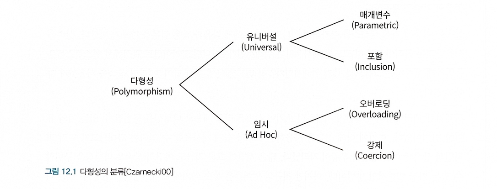

- *상속의 목적은 코드 재사용이 아니다.* 
	- *타입 계층을 구조화하기 위해 사용해야 한다.* 

상속을 이용해 자식 클래스를 추가하려 할 때
1. 상속을 사용하려는 목적이 단순히 코드를 재사용하기 위해서인가?
2. 클라이언트 관점에서 인스턴스들을 동일하게 행동하는 그룹으로 묶기 위해서인가?

> *만약 1번이 이유라면 상속을 사용하지 말아야 한다* 

> 12장 
> 이번장에서 상속의 관점에서 다형성이 구현되는 기술적인 메커니즘을 살펴보고
> 다형성이 런타임에 메세지를 처리하기에 적합한 메서드를 동적으로 탐색하는 과정을 통해 구현되며,
> 상속이 이런 메서드를 찾기 위한 일종의 탐색 경로를 클래스 계층의 형태로 구현하기 위한 방법이라는 사실을 이해하게 된다.

# 🐷 다형성
> 다형성(Polymorphism) : "많은 형태를 가질 수 있는 능력"
> > 하나의 추상 인터페이스에 대해 코드를 작성하고 이 추상 인터페이스에 대해 서로 다른 구현을 연결할 수 있는 능력으로 정의한다.

#객체지향/객체지향프로그래밍에서-사용되는-다형성
- 객체지향 프로그래밍에서 사용되는 다형성
	- 유니버설(Universal) 다형성
		- 매개변수(Parametric) 다형성
		- 포함(Inclustion) 다형성
	- 임시(Ad Hoc) 다형성
		- 오버로딩(Overloading) 다형성
		- 강제(Coercion) 다형성



- [0] 오버로딩 다형성(Overloading)
- 하나의 클래스 안에 동일한 이름의 메서드가 존재하는 경우

- [1] 강제(Coercion)
- 언어가 지원하는 자동 타입 변환이나 사용자가 직접 구현한 타입 변환을 이용해 동일한 연산자를 다양한 타입에 사용할 수 있는 방식
	- ex) 예를 들어 자바에서 이항 연산자인 '+'는 타입에 따라 덧셈으로 동작하기도 하고 연결 동작을 하기도 한다.
```ts title="+연산자 강제 다형성"
// '+' 연산자의 강제 다형성
function addOrConcat(a: number | string, b: number | string): number | string {
  if (typeof a === "number" && typeof b === "number") {
    return a + b;
  } else if (typeof a === "string" && typeof b === "string") {
    return a + b;
  } else {
    return a + b;
  }
}

console.log(addOrConcat(5, 3)); // 출력: 8 (숫자 덧셈)
console.log(addOrConcat("Hello", "World")); // 출력: "HelloWorld" (문자열 연결)
console.log(addOrConcat(5, "3")); // 출력: "53" (숫자가 문자열로 강제 변환)
```

- [2] 매개변수 다형성(Parametric)
- *제네릭 프로그래밍* 과 관련이 높다.
- 클래스의 인스턴스 변수나 메서드의 매개변수 타입을 임의의 타입으로 선언한 후 사용하는 시점에 구체적인 타입으로 지정하는 방식

```typescript title="제네릭 매개변수 다형성"
// 제네릭 함수
function identity<T>(arg: T): T {
    return arg;
}

let output1 = identity<string>("myString");
let output2 = identity<number>(100);

console.log(output1); // 출력: myString
console.log(output2); // 출력: 100
```

- [3] 포함 다형성(Inclusion)
- 메세지가 동일하더라도 수신한 객체의 타입에 따라 실제로 수행되는 행동이 달라지는 능력
- 서브타입(Subtype) 다형성이라고도 부름.
- 포함 다형성은 객체지향 프로그래밍에서 가장 널리 알려진 형태의 다형성
- 포함 다형성을 위한 전제조건은 자식 클래스가 부모 클래스의 서브타입이어야 한다.
	- *상속의 진정한 목적은 코드 재사용이 아니라 다형성을 위한 서브타입 계층을 구축하는 것이다.* 

```typescript title="포함 다형성"
class Movie{
	private discountPolicy: DiscountPolicy;

	constructor(discountPolicy:DiscountPolicy){
		this.discountPolicy = discountPolicy;
	}

	public calculateMovieFee(screening: Screening){
		return fee.minus(discountPolicy.calculateDiscountAmount(screening));
	}
}
```

> 포함 다형성을 구현하는 가장 일반적인 방법은 상속이고
> 자식 클래스에서 부모 클래스의 메서드를 오버라이딩한 후 클라이언트는 부모 클래스만 참조하면 포함 다형성을 구현할 수 있다.

**12장 목표 : 포함 다형성의 관점에서 런타임에 상속 계층 안에서 적절한 메서드를 선택하는 방법을 이해하는 것** 

# 🐨 상속의 양면성
