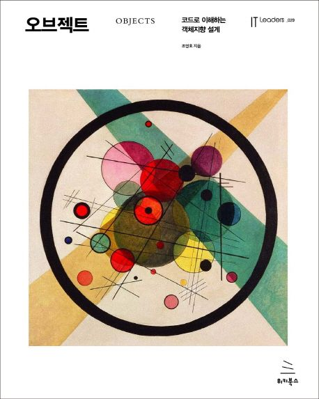

# 오브젝트

# 🔑 요약
# 1장 
- *의존성* 을 제거함으로써 객체 사이의 *결합도* 를 낮추고 낮추기 위한 방법으로 *캡슐화* 하여 객체의 *자율성* 을 높이고 *응집도* 높은 객체들의 공동체를 창조 할 수 있게 되는것이 훌륭한 객체지향 설계이다.
# 2장
- 클래스 추상 클래스, 인터페이스를 조합해서 객체지향 프로그램을 구조화하는 기본적인 방법
- 상속을 이용해 다형성을 구현 하는 기법
- 다형성이 지연 바이딩이라는 메커니즘을 통해 구현된다는 사실
- 상속은 코드를 재사용할 수 있는 가장 널리 알려진 방법이지만 캡슐화의 측면에서 합성이 더 좋은 방법
- 유연한 객체 지향 프로그램을 위해서는 컴파일 시간 의존성과 실행 시간 의존성이 달라야 한다는 사실

# 3장
- 객체를 설계하기 위해 필요한 문맥인 협력을 먼저 갖추고 협력에 필요한 행동을 수행 할 수 있는 적절한 객체를 찾는것이다.
- *객체지향 설계에서 가장 중요한 것은 책임이다* 

## 책임 주도 설계
- 시스템이 사용자에게 제공해야 하는 기능인 시스템 책임을 파악한다.
- 시스템 책임을 더 작은 책임으로 분할한다.
- 분할된 책임을 수행할 수 있는 적절한 객체 또는 역할을 찾아 책임을 할당한다.
- 객체가 책임을 수행하는 도중 다른 객체의 도움이 필요한 경우 이를 책임질 적절한 객체 또는 역할을 찾는다.
- 해당 객체 또는 역할에게 책임을 할당함으로써 두 객체가 협력하게 한다.

# 📆 정리 현황 테이블

아래 테이블에 각 장별로 작성한 README.md 를 링크 (연결) 합니다.

| Priority | Task          | Chapter | Link                                                                                                                                                                                                               |
| -------- | ------------- | ------- | ------------------------------------------------------------------------------------------------------------------------------------------------------------------------------------------------------------------ |
| ⭐⭐⭐⭐⭐    | 1. 객체, 설계     | 1장      | [링크](https://github.com/yanggwangseong/TIL/blob/main/%EB%8F%84%EC%84%9C/%EC%98%A4%EB%B8%8C%EC%A0%9D%ED%8A%B8/Chapter/1.%20%EA%B0%9D%EC%B2%B4%2C%20%EC%84%A4%EA%B3%84.md)                                           |
| ⭐⭐⭐      | 2. 객체지향 프로그래밍 | 2장      | [링크](https://github.com/yanggwangseong/TIL/blob/main/%EB%8F%84%EC%84%9C/%EC%98%A4%EB%B8%8C%EC%A0%9D%ED%8A%B8/Chapter/2.%20%EA%B0%9D%EC%B2%B4%EC%A7%80%ED%96%A5%20%ED%94%84%EB%A1%9C%EA%B7%B8%EB%9E%98%EB%B0%8D.md) |
|          | 3. 역할, 책임, 협력 | 3장      |                                                                                                                                                                                                                    |

# 📝 키워드
#객체지향/depencency , #객체지향/coupling , #객체지향/encapsulation , #객체지향/cohesion