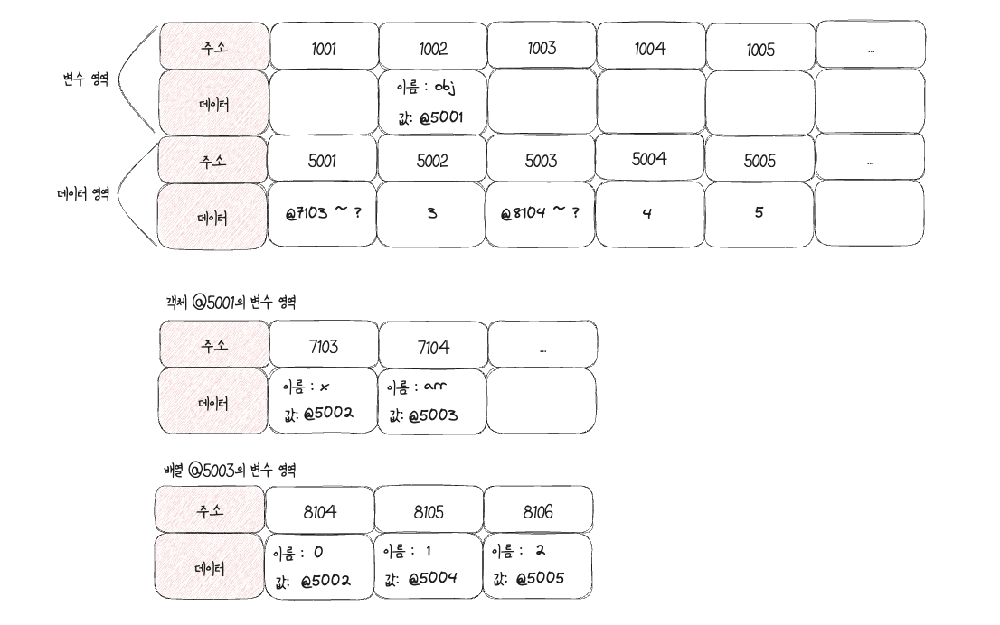

# 데이터 타입
## 데이터 할당
> Javascript에서 변수 영역에 값을 직접 대입하지 않고 데이터 영역에 값을 만들고 해당 주소를 변수 영역의 값에 할당하는 이유는?

- 데이터 변환을 자유롭게 할 수 있다.
- 메모리를 더욱 효율적으로 관리하기 위한 고민의 결과다.
### 예시1
- 문자열 `abc` 의 마지막에 `def` 를 추가하라고 하면 컴퓨터가 `abc` 가 저장된 공간에 `abcdef` 를 할당하는 대신 *새로운 문자열* 을 만들어 별도의 공간에 저장.
- 해당 주소를 변수 공간에 연결한다.
### 예시2
- 500개의 변수를 생성해서 모든 변수에 숫자 5를 할당하는 상황
	- 만약 개별 생성일 경우 : 500개의 변수 공간을 확보 -> 숫자 5를 할당한다고 가정
		- 숫자형은 8바이트 필요 : 총 4000(500 * 8)바이트 사용.
	- 만약 5를 별도의 공간에 한번만 저장 : 예를들어 주소공간이 크키가 2바이트
		- 1008(500 * 2 + 8)바이트만 사용하면 된다!!!

> 결론적으로 변수 영역과 데이터 영역을 분리하면 중복된 데이터에 대한 처리 효율이 높아진다.

- *변수와 상수를 구분 짓는 변경 가능성의 대상 -> 변수 영역 메모리* 
- *불변성 여부를 구분할 때의 변경 가능성의 대상은 -> 데이터 영역 메모리* 
## 불변성
- 데이터 영역의 메모리

```js
var a = 'abc';
a = a + 'def';

var b = 5;
var c = 5;
b = 7;
```

> 변수 `a` 에 문자열 `abc` 를 할당했다가 뒤에 `def` 를 추가하면 기존의 `abc` 가 `abcdef` 로 바뀌는게 아니다.
> 새로운 문자열 `abcdef` 를 만들어 그 주소를 변수 `a` 에 저장.
> `abc` 가 `abcdef` 둘은 완전 별개의 데이터

- 문자열, 숫자 값도 다른 값으로 변경 할 수 없다.
- 변경은 새로 만드는 동작을 통해서만 이뤄집니다.
- *불변값의 성질이다*  -> Primitive type은 불변성을 가진다.
## 가변값
- 기본형 데이터는 불변값
- 참조형 데이터
	- 기본 성질은 가변값
	- 설정에 따라 변경 불가능한 경우도 있고
	- 불변값으로 활용하는 방안도 있다.

> *객체의 변수(프로퍼티)영역* 이 별도로 존재한다.
> 객체가 별도로 할애한 영역은 변수 영역일 뿐 "데이터 영역"은 기존의 메모리 공간을 그대로 활용한다.
> *데이터 영역에 저장된 값은 모두 불변값* 
> 참조형 데이터가 불변 하지 않다(가변값)인 이유?
> > 변수에 다른 값을 얼마든지 대입할 수 있다.

```js
var obj1 = {
	a: 1,
	b: 'bbb'
};
obj1.a = 2;
```

> `obj1` 이 바라보고 있는 주소는 변하지 않는다.
> 즉, '새로운 객체'가 만들어 지는것이 아니라 기존의 객체 내부의 값만 바뀐것이다.
### 중첩객체
```js title="중첩객체"
var obj = {
	x: 3,
	arr: [ 3, 4, 5]
};
```



- `obj.arr[1]` 을 검색하고자 할때

1. obj 검색
	1. obj라는 식별자를 가진 주소를 찾습니다(@1002)
	2. 값이 주소이므로 그 주소로 이동합니다(@5001)
	3. 값이 주소이므로 그 주소로 이동합니다(@7103 ~ ?)
2. `obj.arr` 검색
	1. `arr` 이라는 식별자를 가진 주소를 찾습니다.(@7104)
	2. 값이 주소이므로 그 주소로 이동합니다(@5003)
	3. 값이 주소이므로 그 주소로 이동합니다(@8104 ~ ?)
3. `obj.arr[1]` 검색
	1. 인덱스 1에 해당하는 주소를 찾습니다(@8105)
	2. 값이 주소이므로 그 주소로 이동합니다(@5004)
	3. 값이 숫자형 데이터이므로 4를 반환합니다.


# 변수 복사 비교
```js
var a = 10;
var b = a;
console.log(a);
console.log(b);
b = 20;
console.log(a);
console.log(b);
var obj1 = { c: 10, d: 'ddd' };
var obj2 = obj1;
console.log(obj1);
console.log(obj2);
obj2.c = 20;
console.log(obj1); // { c: 20, d: 'ddd' }
console.log(obj2); // { c: 20, d: 'ddd' }
/*
* 같은 객체를 바라보고 있어서 복사한 obj2의 프로퍼티 c를 변경 했음에도 obj1의 값도
* 마치 같이 바뀐것처럼 보인다.
*/
```

- 변수를 복사하는 과정은 기본형 데이터와 참조형 데이터 모두 같은 주소를 바라보게 되는 점에서 동일하다.
- 기본형 데이터는 복사한 변수의 값을 바꿔면 -> 주소값이 달라짐.
- 참조형 데이터는 복사한 변수의 프로퍼티의 값을 바꾸었더니 -> 값은 달라지지 않았습니다.
	- 즉, `obj1` 과 `obj2` 가 여전히 같은 객체를 바라보고 있는 상태다.

> 이것이 기본형 과 참조형 데이터의 가장 큰 차이점이다.
> *자바스크립트에서 모든 데이터 타입은 참조형 데이터일수 밖에 없다* 
> > 기본형은 주소값을 복사하는 과정이 한번만 이뤄짐
> > 참조형은 한 단계를 더 거치게 된다는차이가 있다.
> *기본형도 결국 주소값을 참조한다* 


## 객체 자체를 변경 했을 때
```js
var a = 10;
var b = a;
var obj1 = { c: 10, d: 'ddd' };
var obj2 = obj1;

b = 15;
obj2 = { c: 20, d: 'ddd' };
```

> `b` 와 마찬가지로 `obj2` 에도 새로운 객체를 할당함으로 값을 직접 변경 했음!

- *참조형 데이터가 '가변값'이라고 설명할 때 '가변'은 참조형 데이터 자체를 변경할 경우가 아니라 그 내부의 프로퍼티를 변경할 때만 성립한다.* 
- 참조형 데이터 자체를 바꾼다면 그것또한 불변값이다.


# 불변 객체
- 참조형 데이터의 '가변'은 데이터 자체가 아닌 내부 프로퍼티를 변경할 때만 성립한다.
- 데이터 자체를 변경하고자 하면 기본 데이터와 마찬가지로 *기존 데이터는 변하지 않는다* 
- `immutable.js` : 내부 프로퍼티를 변경할 필요가 있을때마다 매번 새로운 객체를 만들어 재할당하거나 자동으로 새로운 객체를 만드는 도구


## 어떤 상황에 불변객체가 필요할까?
- **값으로 전달받은 객체에 변경을 가하더라도 원본 객체는 변하지 않아야 하는 경우가 종종 발생** -> 불변객체가 필요하다.

```js title="객체의 가변성에 따른 문제점"
var user = {
	name: 'Jaenam',
	gender: 'male'
};

var changeName = function (user, newName){
	var newUser = user;
	newUser.name = newName;
	return newUser;
}

var user2 = changeName(user, 'Jung');

if(user !== user2){
	console.log('유저 정보가 변경되었습니다.');
}
console.log(user.name, user2.name); // Jung Jung
console.log(user === user2); // ture
```


# QA) 불변객체가 뭔가요?
# QA) 불변객체는 언제 쓰이나요?