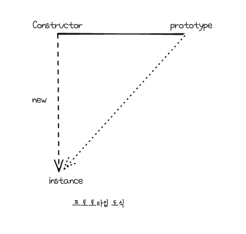

# constructor, prototype, instance


- prototype이라는 프로퍼티와 `__proto__` 라는 프로퍼티 둘의 관계가 프로토타입 개념의 핵심이다.

```js
var Person = function (name){
	this._name = name;
};
Person.prototype.getName = function(){
	return this._name;
};
var suzi = new Person('Suzi');
const result = Object.getPrototypeOf(suzi);
console.log(result.getName()); // undefined
console.log(suzi.getName()); // Suzi
```

- result.getName이 undefined가 나오는 이유는 this 때문이다.
	- `result` 는 `sizi.__proto__._name` 이기 때문에 undefined가 출력 된것이다.
- `__proto__` 가 생략 가능한 프로퍼티이다.

```js
suzi.__proto__.getName
-> suzi(.__proto__).getName
-> suzi.getName
```



- new 연산자로 Constructor를 호출하면 instance가 만들어 지는데, 이 instance의 생략 가능한 프로퍼티인 `__proto__` 는 Constructor의 prototype을 참조 한다.

## 프로토 타입 개념 상세
- 자바스크립트는 함수에 자동으로 객체인 prototype 프로퍼티를 생성해 놓는데
- 해당 함수를 생성자 함수로서 사용할 경우, 즉 new 연산자와 함께 함수를 호출할 경우
- 그로부터 생성된 인스턴스에는 숨겨진 프로퍼티인 `__proto__` 가 자동으로 생성되며
- 이 프로퍼티는 생성자 함수인 `prototype` 프로퍼티를 참조한다.
- `__proto__` 프로퍼티는 생략 가능하도록 구현돼 있기 때문에
- 생성자 함수의 


```js
const isMainRole = false;
const where = {
	...(isMainRole && { role: 'main' }),
}
console.log(where);
const test = isMainRole && 'test';
console.log(test);
```

# QA) 프로토타입이란 무엇인가요?